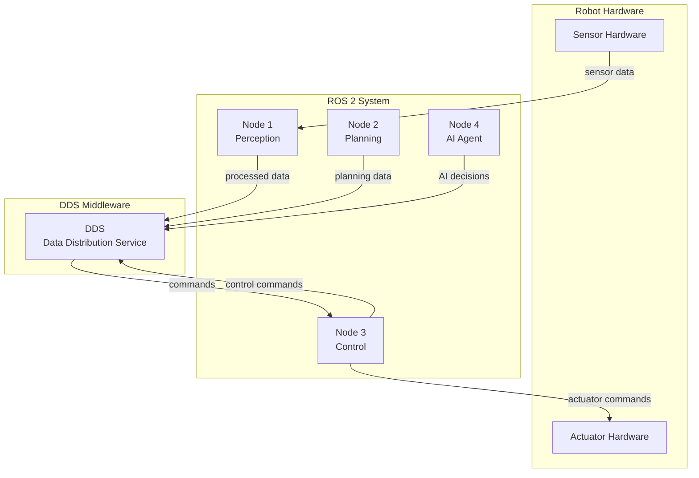
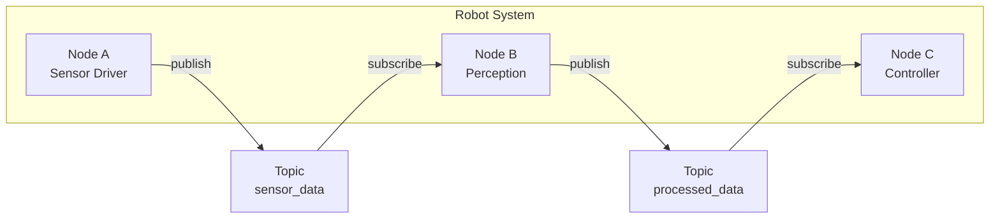

# Introduction to ROS 2 as a Robotic Nervous System

## What ROS 2 is and why it exists

ROS 2 (Robot Operating System 2) is not an operating system, but rather a flexible framework for writing robot software. Think of it as a set of tools, libraries, and conventions that aim to simplify the task of creating complex and robust robot behavior across a wide variety of robot platforms and configurations.

ROS 2 exists to solve several key challenges in robotics development:

- **Hardware abstraction**: Provides standardized interfaces to work with different sensors and actuators, so you don't need to rewrite code when changing hardware
- **Device drivers**: Offers a wide range of pre-built drivers for common hardware, saving development time
- **Visualization**: Tools for monitoring robot state and debugging, helping you understand what your robot is doing
- **Simulation**: Environments for testing robot code without physical hardware, allowing safe development and testing
- **Message passing**: Robust communication between different parts of a robot system, enabling modular design
- **Package management**: Organized distribution of robot software, making it easy to share and reuse code

> **Beginner Tip**: If you're coming from traditional software development, think of ROS 2 as providing similar benefits to frameworks like Django or Express.js, but specifically designed for robotics applications.

## ROS 2 vs traditional software architectures

Traditional software architectures typically follow monolithic or simple client-server patterns. In contrast, ROS 2 uses a distributed, component-based architecture where:

- **Nodes** represent individual processes that perform specific functions (like separate apps working together)
- **Topics** enable asynchronous communication through publish/subscribe patterns (like a radio broadcast system)
- **Services** provide synchronous request/response communication (like a web API call)
- **Actions** support long-running tasks with feedback and goal management (like ordering a pizza with status updates)

This architecture is particularly well-suited for robotics because it allows for:
- Modular development where components can be developed and tested independently
- Easy replacement of components without affecting the entire system
- Parallel execution of different robot functions
- Fault tolerance through isolation of components

> **Analogy**: Think of ROS 2 architecture like a city infrastructure where:
> - Nodes are like different city departments (police, fire, utilities)
> - Topics are like public announcements or radio broadcasts
> - Services are like calling specific departments for help
> - Actions are like requesting a long-term project with progress updates

## Middleware concepts (DDS, pub-sub, real-time constraints)

ROS 2 uses Data Distribution Service (DDS) as its underlying communication middleware. Think of DDS as a standardized communication layer that ensures reliable data exchange between robot components, even in complex distributed systems.

### Data Distribution Service (DDS)

DDS provides:
- **Data-centricity**: Communication is based on data rather than network endpoints (like sharing documents in the cloud rather than sending files directly)
- **Quality of Service (QoS)**: Configurable reliability, durability, and performance characteristics (like choosing between express or standard shipping)
- **Discovery**: Automatic discovery of publishers and subscribers (components find each other automatically)
- **Real-time performance**: Deterministic behavior for time-critical applications (guaranteed delivery within specific time limits)

> **Beginner Tip**: If you're familiar with web development, DDS is like a more sophisticated version of message queues (like RabbitMQ or Apache Kafka) but designed specifically for robotics with stronger guarantees about timing and reliability.

### Publish-Subscribe Pattern

The publish-subscribe pattern in ROS 2 enables:
- **Decoupling**: Publishers and subscribers don't need to know about each other (like a newspaper publisher and readers)
- **Scalability**: Multiple subscribers can listen to the same topic (like multiple people reading the same newspaper)
- **Asynchronous communication**: Publishers and subscribers can operate at different rates (like a radio station broadcasting while listeners tune in and out)
- **Broadcasting**: One publisher can send data to many subscribers simultaneously (like a weather station broadcasting to multiple weather apps)

### Real-time constraints

ROS 2 addresses real-time requirements through:
- QoS policies that can guarantee message delivery within time constraints (like guaranteed delivery services)
- Support for real-time operating systems (systems that prioritize time-critical tasks)
- Deterministic communication patterns (predictable timing behavior)
- Priority-based message handling (critical messages get processed first)

## Role of ROS 2 in humanoid robotics and Physical AI

In humanoid robotics, ROS 2 serves as the "nervous system" by:

- **Coordinating sensors**: Managing data from cameras, IMUs, joint encoders, and other sensors (like how your sensory nerves collect information from your body)
- **Controlling actuators**: Sending commands to motors and other actuators (like how your motor nerves control your muscles)
- **Processing perception**: Handling computer vision, audio processing, and other sensory data (like how your brain interprets sensory information)
- **Executing behaviors**: Coordinating complex robot behaviors and actions (like how your brain plans and executes movements)
- **Connecting AI systems**: Bridging high-level AI decision-making with low-level control (like the connection between conscious thought and automatic reflexes)

For Physical AI applications, ROS 2 provides the infrastructure needed to:
- Integrate AI models with physical robot systems (connecting AI "brain" with robot "body")
- Handle the complexity of embodied intelligence (intelligence that exists in a physical form)
- Enable learning from real-world robot interactions (like how humans learn through physical experience)
- Support research in robot learning and autonomy (independent decision-making capabilities)

> **Key Insight**: The "nervous system" analogy is particularly apt because, just like in biological systems, ROS 2 components work together to allow the robot to sense, think, and act as a coordinated whole.

## Visual Diagrams

### ROS 2 Architecture Overview
*Diagram showing the relationship between robot hardware, ROS 2 system components, and DDS middleware*



### Node Communication Pattern
*Diagram showing the publish-subscribe communication pattern between nodes using topics*



## Hands-on Exercises

### Exercise 1: ROS 2 Environment Setup
1. Install ROS 2 Humble Hawksbill on your development machine
2. Verify the installation by running `ros2 topic list`
3. Source the ROS 2 environment and confirm it's working

### Exercise 2: Understanding the DDS Concept
1. Research the difference between DDS and traditional message passing systems
2. List three advantages of using DDS in robotics applications
3. Explain why DDS is particularly important for real-time robotic systems

### Exercise 3: ROS 2 Architecture Exploration
1. Create a simple ROS 2 workspace
2. Identify the main components of the ROS 2 architecture in your system
3. Document the purpose of each component you find

## Summary

In this chapter, we introduced ROS 2 as the foundational nervous system for humanoid robots. We covered what ROS 2 is and why it exists, compared it to traditional software architectures, and explored middleware concepts like DDS, pub-sub, and real-time constraints.

import Tabs from '@theme/Tabs';
import TabItem from '@theme/TabItem';

## Interactive Learning Elements

### Knowledge Check: ROS 2 Fundamentals

Let's test your understanding of the core concepts we've covered:

<details>
  <summary>What does DDS stand for in the context of ROS 2?</summary>
  <p>Answer: Data Distribution Service. DDS stands for Data Distribution Service, which is the underlying communication middleware that ROS 2 uses to ensure reliable data exchange between robot components.</p>
</details>

### Expandable Reference: ROS 2 Architecture Components

<details>
  <summary>Detailed Architecture Components</summary>
  <p>Here are the key components of the ROS 2 architecture:</p>
  <ul>
    <li><strong>Nodes</strong>: Individual processes that perform specific functions</li>
    <li><strong>Topics</strong>: Enable asynchronous communication through publish/subscribe patterns</li>
    <li><strong>Services</strong>: Provide synchronous request/response communication</li>
    <li><strong>Actions</strong>: Support long-running tasks with feedback and goal management</li>
    <li><strong>Parameters</strong>: Configuration values that can be changed at runtime</li>
    <li><strong>Interfaces</strong>: Message and service definitions that enable communication</li>
  </ul>
</details>

### Interactive Code Example

```python title="Simple ROS 2 Node Example"
import rclpy
from rclpy.node import Node

class MinimalPublisher(Node):

    def __init__(self):
        super().__init__('minimal_publisher')
        self.publisher = self.create_publisher(String, 'topic', 10)
        timer_period = 0.5  # seconds
        self.timer = self.create_timer(timer_period, self.timer_callback)
        self.i = 0

    def timer_callback(self):
        msg = String()
        msg.data = 'Hello World: %d' % self.i
        self.publisher.publish(msg)
        self.get_logger().info('Publishing: "%s"' % msg.data)
        self.i += 1
```

### Multi-Language Code Examples

<Tabs groupId="lang-choice">
  <TabItem value="python" label="Python">
    ```python
    import rclpy
    from rclpy.node import Node

    class MinimalPublisher(Node):
        def __init__(self):
            super().__init__('minimal_publisher')
            self.publisher = self.create_publisher(String, 'topic', 10)
    ```
  </TabItem>
  <TabItem value="cpp" label="C++">
    ```cpp
    #include <rclcpp/rclcpp.hpp>
    #include <std_msgs/msg/string.hpp>

    class MinimalPublisher : public rclcpp::Node
    {
    public:
      MinimalPublisher()
      : Node("minimal_publisher")
      {
        publisher_ = this->create_publisher<std_msgs::msg::String>("topic", 10);
      }
    };
    ```
  </TabItem>
</Tabs>

## Next Steps

In the next chapter, we'll dive into the communication primitives of ROS 2, exploring how nodes, topics, services, and actions work together to create complex robot behaviors.

## Navigation

- **Next Chapter**: [Chapter 2: ROS 2 Communication Primitives](../module-1/chapter-2-ros2-communication-primitives)