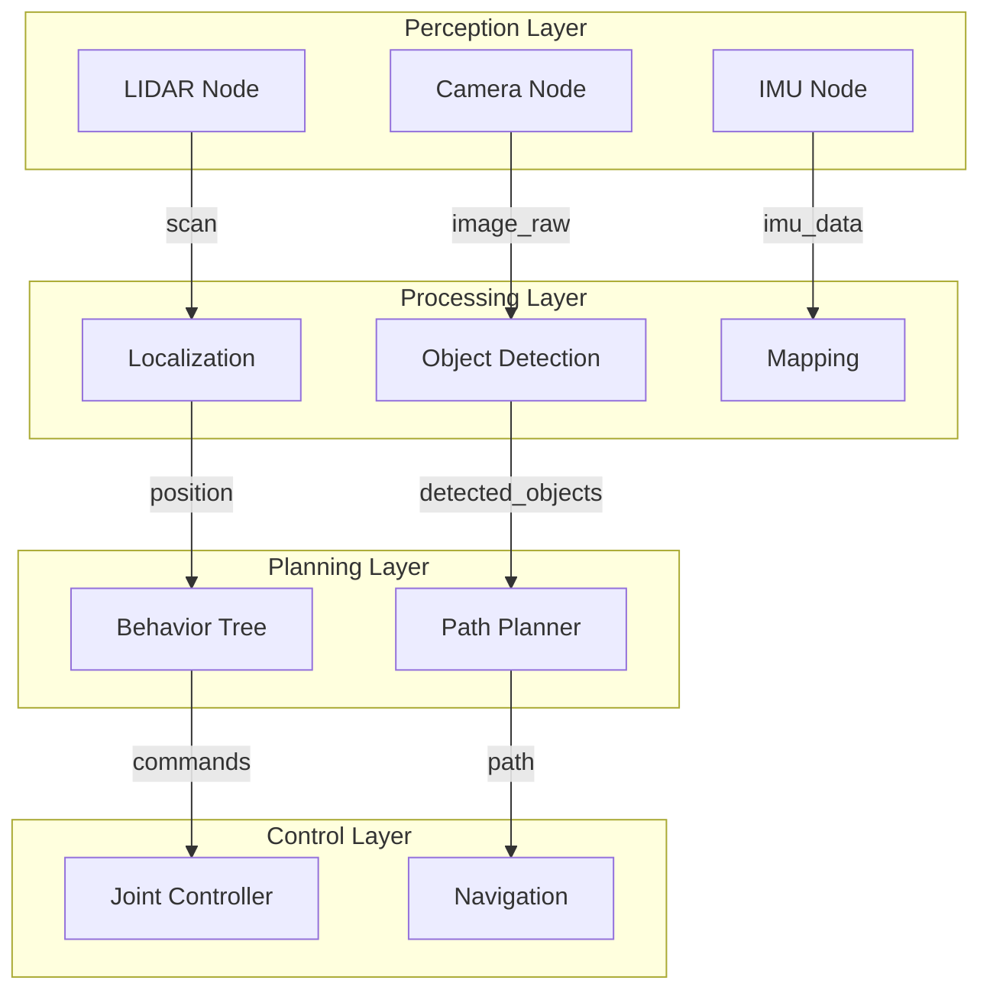
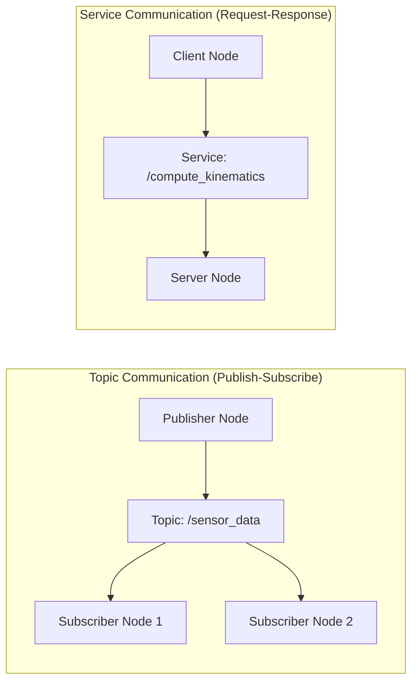

# ROS 2 Communication Primitives

## Nodes, Topics, Services, and Actions

ROS 2 provides four primary communication mechanisms that enable different types of interactions between robot components:

### Nodes

A **node** is an executable that uses ROS 2 to communicate with other nodes. Think of nodes as individual programs or processes that each handle a specific task. Nodes are the fundamental building blocks of a ROS 2 system. Each node typically performs a specific function such as:

- Sensor data processing
- Control algorithm execution
- Hardware interface management
- Planning and decision making

Nodes are organized into a graph where they communicate via topics, services, and actions.

> **Beginner Tip**: If you're familiar with web development, think of nodes as individual microservices that each handle a specific function. Each node can be developed, tested, and maintained independently.

### Topics and Publish-Subscribe

**Topics** use a publish-subscribe communication pattern where:
- Publishers send data to a topic
- Subscribers receive data from a topic
- Multiple publishers and subscribers can exist for the same topic
- Communication is asynchronous and decoupled

This pattern is ideal for:
- Sensor data distribution
- Robot state broadcasting
- Continuous data streams

> **Analogy**: Think of topics like a radio station (publisher) broadcasting to multiple radios (subscribers). The radio station doesn't know who's listening, and listeners can tune in and out without affecting the broadcast.

### Services

**Services** use a request-response communication pattern where:
- A client sends a request to a server
- The server processes the request and sends a response
- Communication is synchronous
- Each service has a specific request and response message type

This pattern is ideal for:
- One-time requests like calibration
- Actions that return a specific result
- Synchronous operations

> **Analogy**: Think of services like making a phone call. You call someone (client), they answer and process your request (server), and then give you a response. The conversation is direct and synchronous.

### Actions

**Actions** are used for long-running tasks and include:
- Goal: Request for the action to start
- Feedback: Periodic updates on progress
- Result: Final outcome when the action completes

This pattern is ideal for:
- Navigation to a goal
- Complex manipulation tasks
- Any operation that takes time and needs monitoring

> **Analogy**: Think of actions like ordering food delivery. You place an order (goal), get updates on preparation and delivery status (feedback), and finally receive your food (result).

## Data flow between sensors, controllers, and AI agents

In a typical robotic system, data flows through multiple layers in a pipeline-like fashion:

```
Sensors → Perception → Planning → Control → Actuators
```

Think of this like a factory assembly line where each station processes the input and passes it to the next station.

### Sensor Data Processing

Sensors publish data to topics such as:
- Camera images to `/camera/image_raw` (like a continuous video feed)
- LIDAR scans to `/scan` (like a 360-degree distance measurement)
- IMU data to `/imu/data` (like a digital compass and accelerometer)
- Joint states to `/joint_states` (like position feedback from robot joints)

> **Beginner Tip**: These topic names follow ROS conventions where the forward slash indicates a namespace, making it easier to organize related topics.

### Perception Layer

Perception nodes subscribe to sensor data and publish processed information:
- Object detection results (identifying objects in camera images)
- Localization estimates (determining where the robot is in space)
- Environment maps (creating a representation of the surroundings)

> **Analogy**: This is like how your eyes send raw visual data to your brain, which then interprets what you're seeing.

### Planning Layer

Planning nodes use perception data to make decisions:
- Path planning (finding the best route from A to B)
- Motion planning (determining how to move the robot's parts)
- Task planning (deciding what actions to take in sequence)

> **Analogy**: This is like how your brain decides how to reach for an object based on what it sees and where it thinks the object is located.

### Control Layer

Control nodes execute planned actions:
- Joint position controllers (moving robot joints to specific positions)
- Trajectory execution (following a planned path smoothly)
- Force control (applying specific amounts of force when interacting with objects)

> **Analogy**: This is like how your motor cortex sends signals to your muscles to execute the planned movement.

## Writing Python-based ROS 2 nodes using rclpy

The `rclpy` library provides the Python client interface for ROS 2. Think of it as the toolkit that allows you to create ROS 2 nodes using Python.

Here's a basic example of a publisher node:

```python
import rclpy
from rclpy.node import Node
from std_msgs.msg import String

class MinimalPublisher(Node):

    def __init__(self):
        super().__init__('minimal_publisher')  # Initialize the node with a name
        self.publisher_ = self.create_publisher(String, 'topic', 10)  # Create publisher
        timer_period = 0.5  # seconds - how often to publish
        self.timer = self.create_timer(timer_period, self.timer_callback)  # Create timer
        self.i = 0  # Counter to keep track of messages

    def timer_callback(self):
        msg = String()  # Create a message object
        msg.data = 'Hello World: %d' % self.i  # Set message content
        self.publisher_.publish(msg)  # Publish the message
        self.get_logger().info('Publishing: "%s"' % msg.data)  # Log what was published
        self.i += 1  # Increment counter

def main(args=None):
    rclpy.init(args=args)  # Initialize ROS communications
    minimal_publisher = MinimalPublisher()  # Create the publisher node
    rclpy.spin(minimal_publisher)  # Keep the node running
    minimal_publisher.destroy_node()  # Clean up
    rclpy.shutdown()  # Shutdown ROS communications

if __name__ == '__main__':
    main()
```

And here's a corresponding subscriber:

```python
import rclpy
from rclpy.node import Node
from std_msgs.msg import String

class MinimalSubscriber(Node):

    def __init__(self):
        super().__init__('minimal_subscriber')  # Initialize the node with a name
        self.subscription = self.create_subscription(
            String,  # Message type
            'topic',  # Topic name
            self.listener_callback,  # Callback function
            10)  # Queue size
        self.subscription  # prevent unused variable warning

    def listener_callback(self, msg):
        self.get_logger().info('I heard: "%s"' % msg.data)  # Log the received message

def main(args=None):
    rclpy.init(args=args)  # Initialize ROS communications
    minimal_subscriber = MinimalSubscriber()  # Create the subscriber node
    rclpy.spin(minimal_subscriber)  # Keep the node running to receive messages
    minimal_subscriber.destroy_node()  # Clean up
    rclpy.shutdown()  # Shutdown ROS communications

if __name__ == '__main__':
    main()
```

> **Beginner Tip**: Notice how the publisher uses `create_publisher()` and the subscriber uses `create_subscription()`. These functions create the communication endpoints that allow nodes to send and receive messages.

## Advanced rclpy Examples

### Service Server Example

```python
import rclpy
from rclpy.node import Node
from example_interfaces.srv import AddTwoInts

class MinimalService(Node):

    def __init__(self):
        super().__init__('minimal_service')
        self.srv = self.create_service(AddTwoInts, 'add_two_ints', self.add_two_ints_callback)

    def add_two_ints_callback(self, request, response):
        response.sum = request.a + request.b
        self.get_logger().info('Incoming request\na: %d b: %d' % (request.a, request.b))
        return response

def main(args=None):
    rclpy.init(args=args)
    minimal_service = MinimalService()
    rclpy.spin(minimal_service)
    rclpy.shutdown()

if __name__ == '__main__':
    main()
```

### Service Client Example

```python
import sys
import rclpy
from rclpy.node import Node
from example_interfaces.srv import AddTwoInts

class MinimalClient(Node):

    def __init__(self):
        super().__init__('minimal_client')
        self.cli = self.create_client(AddTwoInts, 'add_two_ints')
        while not self.cli.wait_for_service(timeout_sec=1.0):
            self.get_logger().info('service not available, waiting again...')
        self.req = AddTwoInts.Request()

    def send_request(self, a, b):
        self.req.a = a
        self.req.b = b
        self.future = self.cli.call_async(self.req)
        rclpy.spin_until_future_complete(self, self.future)
        return self.future.result()

def main(args=None):
    rclpy.init(args=args)
    minimal_client = MinimalClient()
    response = minimal_client.send_request(int(sys.argv[1]), int(sys.argv[2]))
    minimal_client.get_logger().info(
        'Result of add_two_ints: for %d + %d = %d' %
        (int(sys.argv[1]), int(sys.argv[2]), response.sum))
    minimal_client.destroy_node()
    rclpy.shutdown()

if __name__ == '__main__':
    main()
```

### Action Server Example

```python
import time
import rclpy
from rclpy.action import ActionServer
from rclpy.node import Node
from example_interfaces.action import Fibonacci

class FibonacciActionServer(Node):

    def __init__(self):
        super().__init__('fibonacci_action_server')
        self._action_server = ActionServer(
            self,
            Fibonacci,
            'fibonacci',
            self.execute_callback)

    def execute_callback(self, goal_handle):
        self.get_logger().info('Executing goal...')

        feedback_msg = Fibonacci.Feedback()
        feedback_msg.sequence = [0, 1]

        for i in range(1, goal_handle.request.order):
            if goal_handle.is_cancel_requested:
                goal_handle.canceled()
                self.get_logger().info('Goal canceled')
                return Fibonacci.Result()

            feedback_msg.sequence.append(
                feedback_msg.sequence[i] + feedback_msg.sequence[i-1])

            goal_handle.publish_feedback(feedback_msg)
            time.sleep(1)

        goal_handle.succeed()
        result = Fibonacci.Result()
        result.sequence = feedback_msg.sequence
        self.get_logger().info('Returning result: {0}'.format(result.sequence))

        return result

def main(args=None):
    rclpy.init(args=args)
    fibonacci_action_server = FibonacciActionServer()
    rclpy.spin(fibonacci_action_server)
    fibonacci_action_server.destroy_node()
    rclpy.shutdown()

if __name__ == '__main__':
    main()
```

## Bridging AI agents (LLMs / planners) to ROS controllers conceptually

Modern robotics increasingly integrates AI systems with traditional ROS control stacks. This integration typically involves:

### High-Level Planning

AI agents can provide high-level goals and plans that are then executed by ROS controllers:

```
AI Agent → ROS Action Client → ROS Action Server → Robot Hardware
```

### Perception Integration

AI-based perception systems can enhance traditional sensor processing:

```
Raw Sensors → AI Perception → ROS Topics → Traditional ROS Nodes
```

### Learning and Adaptation

AI systems can learn from robot experiences and improve control strategies:

```
Robot Experience → Learning System → Updated Control Parameters → ROS Controllers
```

## Visual Diagrams

### Node Communication Architecture
*Diagram showing the layered architecture of a typical robotic system with Perception, Processing, Planning, and Control layers*



### Service vs Topic Communication
*Diagram comparing the publish-subscribe pattern with the request-response pattern in ROS 2*



## Hands-on Exercises

### Exercise 1: Creating Your First Publisher and Subscriber
1. Create a simple ROS 2 workspace
2. Write a publisher node that publishes "Hello World" messages to a topic
3. Write a subscriber node that listens to the topic and prints received messages
4. Run both nodes and verify they communicate correctly

### Exercise 2: Understanding Services
1. Create a service server that performs a simple calculation (e.g., adding two numbers)
2. Create a service client that sends requests to the server
3. Test the client-server communication and verify the results

### Exercise 3: Node Communication Practice
1. Create two nodes that communicate via a topic
2. Use `ros2 topic echo` to monitor the communication
3. Experiment with different message types (String, Int32, etc.)
4. Observe how changing the publisher affects the subscriber

## Summary

In this chapter, we explored the communication primitives of ROS 2. We covered nodes, topics, services, and actions, learned about data flow between sensors, controllers, and AI agents, and practiced with Python-based ROS 2 nodes using rclpy.

## Next Steps

In the next chapter, we'll explore URDF (Unified Robot Description Format) and how it's used to model humanoid robots and their structure.

## Navigation

- **Previous Chapter**: [Chapter 1: Introduction to ROS 2 as a Robotic Nervous System](../module-1/chapter-1-introduction-to-ros2)
- **Next Chapter**: [Chapter 3: Humanoid Robot Structure with URDF](../module-1/chapter-3-urdf-humanoid-robot-structure)