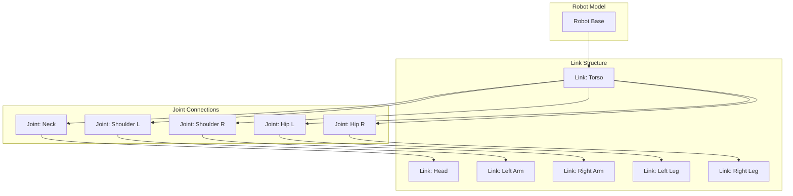
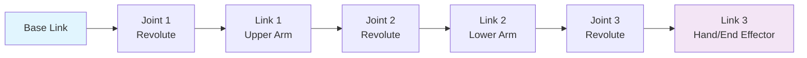

# Humanoid Robot Structure with URDF

## Purpose of URDF in robotics

URDF (Unified Robot Description Format) is an XML-based format used to describe robot models in ROS. Think of URDF as a blueprint that tells ROS everything about your robot's physical structure. It serves as the standard way to represent robot structure, including:

- **Physical structure**: Links that represent rigid parts of the robot (like how CAD files define physical parts)
- **Joints**: Connections between links that allow motion (like hinges and motors in real life)
- **Inertial properties**: Mass, center of mass, and inertia tensor (needed for physics simulation)
- **Visual properties**: How the robot appears in simulation (colors, shapes, materials)
- **Collision properties**: How the robot interacts with the environment (for collision detection)

URDF is essential for:
- Robot simulation in tools like Gazebo
- Robot visualization in RViz
- Kinematic analysis and inverse kinematics
- Motion planning and control

> **Beginner Tip**: Think of URDF like an IKEA instruction manual for your robot - it defines how all the parts fit together and how they can move relative to each other.

## Links, joints, frames, and kinematic chains

### Links

A **link** represents a rigid body part of the robot - think of it as a single piece that doesn't move internally (like a robot arm segment or a wheel). Each link has:

- A unique name (like a label for identification)
- Inertial properties (mass, center of mass, inertia tensor - needed for physics simulation)
- Visual properties (shape, color, mesh - how it looks in simulation)
- Collision properties (shape for collision detection - how it interacts with other objects)

> **Analogy**: A link is like a single bone in your body - it's a rigid structure that doesn't bend or move by itself.

Example of a simple link:
```xml
<link name="base_link">
  <inertial>
    <mass value="1.0" />
    <origin xyz="0 0 0" />
    <inertia ixx="0.1" ixy="0.0" ixz="0.0" iyy="0.1" iyz="0.0" izz="0.1" />
  </inertial>
  <visual>
    <origin xyz="0 0 0" rpy="0 0 0" />
    <geometry>
      <cylinder length="0.1" radius="0.1" />
    </geometry>
    <material name="blue">
      <color rgba="0 0 1 1" />
    </material>
  </visual>
  <collision>
    <origin xyz="0 0 0" rpy="0 0 0" />
    <geometry>
      <cylinder length="0.1" radius="0.1" />
    </geometry>
  </collision>
</link>
```

### Joints

A **joint** connects two links and defines how they can move relative to each other. Think of joints as the "hinges" or "connections" between links. Joint types include:

- **Fixed**: No movement allowed (rigid connection - like a welded joint)
- **Revolute**: Rotational movement around an axis (like an elbow or knee)
- **Continuous**: Unlimited rotational movement (like a wheel that can spin freely)
- **Prismatic**: Linear sliding movement (like a sliding door or piston)
- **Planar**: Movement in a plane (like a drawer that can move in 2D)
- **Floating**: 6 degrees of freedom (can move and rotate freely in 3D space)

> **Analogy**: Joints are like the joints in your body - they determine how different body parts can move relative to each other.

Example of a joint:
```xml
<joint name="base_to_wheel" type="continuous">
  <parent link="base_link" />
  <child link="wheel_link" />
  <origin xyz="0.1 0 0" rpy="0 0 0" />
  <axis xyz="0 0 1" />
</joint>
```

### Frames

A **frame** is a coordinate system attached to a link. Think of frames as reference points that help the robot understand where things are in space. Frames are crucial for:
- Defining relative positions and orientations (where one part is relative to another)
- Transformations between different parts of the robot (how to convert coordinates from one part to another)
- Robot localization and mapping (where the robot thinks it is in the world)

> **Analogy**: Frames are like coordinate systems in a video game - they help define where objects are relative to each other.

### Kinematic Chains

A **kinematic chain** is a sequence of links connected by joints. Think of it as a "chain" of connected parts that can move together. For humanoid robots, common kinematic chains include:

- **Leg chain**: Hip → Knee → Ankle → Foot (the chain of joints from your hip to your foot)
- **Arm chain**: Shoulder → Elbow → Wrist → Hand (the chain of joints from your shoulder to your hand)
- **Head chain**: Neck → Head (the connection between your torso and head)

> **Analogy**: A kinematic chain is like a chain of metal links - each link can move relative to the next one, creating complex movements from simple connections.

## Modeling humanoid robots (arms, legs, torso, head)

Modeling a humanoid robot in URDF involves creating a tree structure of links and joints. Think of this tree structure like a family tree where each link has one "parent" and can have multiple "children" - this creates the complete robot structure.

> **Analogy**: The tree structure is like a family tree - the torso is like the "parent", and the head, arms, and legs are like "children" that branch out from it.

Here's an example of a simplified humanoid upper body:

```xml
<?xml version="1.0"?>
<robot name="simple_humanoid">
  <!-- Torso - the main body of the robot -->
  <link name="torso">
    <visual>
      <geometry>
        <box size="0.3 0.2 0.5" />
      </geometry>
      <material name="white">
        <color rgba="1 1 1 1" />
      </material>
    </visual>
    <collision>
      <geometry>
        <box size="0.3 0.2 0.5" />
      </geometry>
    </collision>
  </link>

  <!-- Head - connected to torso via neck joint -->
  <joint name="neck_joint" type="revolute">
    <parent link="torso" />
    <child link="head" />
    <origin xyz="0 0 0.3" />
    <axis xyz="0 1 0" />
    <limit lower="-0.5" upper="0.5" effort="100" velocity="1" />
  </joint>

  <link name="head">
    <visual>
      <geometry>
        <sphere radius="0.1" />
      </geometry>
      <material name="skin">
        <color rgba="1 0.8 0.6 1" />
      </material>
    </visual>
  </link>

  <!-- Left Arm - shoulder connects to torso, elbow connects upper and lower arm -->
  <joint name="left_shoulder_joint" type="revolute">
    <parent link="torso" />
    <child link="left_upper_arm" />
    <origin xyz="0.2 0.1 0" rpy="0 0 0" />
    <axis xyz="0 1 0" />
    <limit lower="-1.57" upper="1.57" effort="100" velocity="1" />
  </joint>

  <link name="left_upper_arm">
    <visual>
      <geometry>
        <cylinder length="0.3" radius="0.05" />
      </geometry>
      <material name="blue">
        <color rgba="0 0 1 1" />
      </material>
    </visual>
  </link>

  <joint name="left_elbow_joint" type="revolute">
    <parent link="left_upper_arm" />
    <child link="left_lower_arm" />
    <origin xyz="0 0 -0.3" />
    <axis xyz="0 1 0" />
    <limit lower="-1.57" upper="1.57" effort="100" velocity="1" />
  </joint>

  <link name="left_lower_arm">
    <visual>
      <geometry>
        <cylinder length="0.25" radius="0.04" />
      </geometry>
    </visual>
  </link>
</robot>
```

## Practical Examples of URDF Files for Humanoid Components

### Complete Lower Body Example

Here's an example of how to model the lower body of a humanoid robot:

```xml
<!-- Right Leg -->
<joint name="right_hip_joint" type="revolute">
  <parent link="torso" />
  <child link="right_upper_leg" />
  <origin xyz="-0.1 0 0" rpy="0 0 0" />
  <axis xyz="0 1 0" />
  <limit lower="-1.57" upper="0.78" effort="200" velocity="1" />
</joint>

<link name="right_upper_leg">
  <visual>
    <geometry>
      <cylinder length="0.4" radius="0.06" />
    </geometry>
    <material name="gray">
      <color rgba="0.5 0.5 0.5 1" />
    </material>
  </visual>
  <collision>
    <geometry>
      <cylinder length="0.4" radius="0.06" />
    </geometry>
  </collision>
  <inertial>
    <mass value="5.0" />
    <origin xyz="0 0 -0.2" />
    <inertia ixx="0.2" ixy="0.0" ixz="0.0" iyy="0.2" iyz="0.0" izz="0.01" />
  </inertial>
</link>

<joint name="right_knee_joint" type="revolute">
  <parent link="right_upper_leg" />
  <child link="right_lower_leg" />
  <origin xyz="0 0 -0.4" rpy="0 0 0" />
  <axis xyz="0 1 0" />
  <limit lower="0" upper="2.35" effort="200" velocity="1" />
</joint>

<link name="right_lower_leg">
  <visual>
    <geometry>
      <cylinder length="0.4" radius="0.05" />
    </geometry>
  </visual>
  <collision>
    <geometry>
      <cylinder length="0.4" radius="0.05" />
    </geometry>
  </collision>
  <inertial>
    <mass value="3.0" />
    <origin xyz="0 0 -0.2" />
    <inertia ixx="0.1" ixy="0.0" ixz="0.0" iyy="0.1" iyz="0.0" izz="0.01" />
  </inertial>
</link>

<joint name="right_ankle_joint" type="revolute">
  <parent link="right_lower_leg" />
  <child link="right_foot" />
  <origin xyz="0 0 -0.4" rpy="0 0 0" />
  <axis xyz="1 0 0" />
  <limit lower="-0.78" upper="0.78" effort="100" velocity="1" />
</joint>

<link name="right_foot">
  <visual>
    <geometry>
      <box size="0.2 0.1 0.05" />
    </geometry>
  </visual>
  <collision>
    <geometry>
      <box size="0.2 0.1 0.05" />
    </geometry>
  </collision>
</link>
```

### Complete Humanoid Robot with All Components

Here's a simplified full humanoid robot that includes all major components:

```xml
<?xml version="1.0"?>
<robot name="full_humanoid">
  <!-- Base link -->
  <link name="base_link">
    <inertial>
      <mass value="10.0" />
      <origin xyz="0 0 0" />
      <inertia ixx="1.0" ixy="0.0" ixz="0.0" iyy="1.0" iyz="0.0" izz="1.0" />
    </inertial>
  </link>

  <!-- Torso (connecting base to upper body) -->
  <joint name="base_to_torso" type="fixed">
    <parent link="base_link" />
    <child link="torso" />
    <origin xyz="0 0 0.2" />
  </joint>

  <link name="torso">
    <visual>
      <origin xyz="0 0 0.25" />
      <geometry>
        <box size="0.3 0.2 0.5" />
      </geometry>
      <material name="white">
        <color rgba="1 1 1 1" />
      </material>
    </visual>
    <collision>
      <origin xyz="0 0 0.25" />
      <geometry>
        <box size="0.3 0.2 0.5" />
      </geometry>
    </collision>
    <inertial>
      <mass value="8.0" />
      <origin xyz="0 0 0.25" />
      <inertia ixx="0.5" ixy="0.0" ixz="0.0" iyy="0.5" iyz="0.0" izz="0.2" />
    </inertial>
  </link>

  <!-- Head -->
  <joint name="neck_joint" type="revolute">
    <parent link="torso" />
    <child link="head" />
    <origin xyz="0 0 0.5" />
    <axis xyz="0 1 0" />
    <limit lower="-0.78" upper="0.78" effort="10" velocity="1" />
  </joint>

  <link name="head">
    <visual>
      <geometry>
        <sphere radius="0.1" />
      </geometry>
      <material name="skin">
        <color rgba="1 0.8 0.6 1" />
      </material>
    </visual>
    <inertial>
      <mass value="2.0" />
      <inertia ixx="0.02" ixy="0.0" ixz="0.0" iyy="0.02" iyz="0.0" izz="0.02" />
    </inertial>
  </link>

  <!-- Left Arm -->
  <joint name="left_shoulder_joint" type="revolute">
    <parent link="torso" />
    <child link="left_upper_arm" />
    <origin xyz="0.2 0.1 0.25" rpy="0 0 0" />
    <axis xyz="0 1 0" />
    <limit lower="-1.57" upper="1.57" effort="50" velocity="1" />
  </joint>

  <link name="left_upper_arm">
    <visual>
      <geometry>
        <cylinder length="0.3" radius="0.05" />
      </geometry>
      <material name="blue">
        <color rgba="0 0 1 1" />
      </material>
    </visual>
    <inertial>
      <mass value="2.0" />
      <origin xyz="0 0 -0.15" />
      <inertia ixx="0.02" ixy="0.0" ixz="0.0" iyy="0.02" iyz="0.0" izz="0.001" />
    </inertial>
  </link>

  <joint name="left_elbow_joint" type="revolute">
    <parent link="left_upper_arm" />
    <child link="left_lower_arm" />
    <origin xyz="0 0 -0.3" />
    <axis xyz="0 1 0" />
    <limit lower="-1.57" upper="1.57" effort="50" velocity="1" />
  </joint>

  <link name="left_lower_arm">
    <visual>
      <geometry>
        <cylinder length="0.25" radius="0.04" />
      </geometry>
    </visual>
    <inertial>
      <mass value="1.5" />
      <origin xyz="0 0 -0.125" />
      <inertia ixx="0.01" ixy="0.0" ixz="0.0" iyy="0.01" iyz="0.0" izz="0.001" />
    </inertial>
  </link>
</robot>
```

## How URDF connects to simulation and control stacks

### Simulation Integration

URDF models are used by simulation engines like Gazebo to:
- Create physics models of the robot (so the simulated robot moves realistically with proper physics)
- Simulate sensor data (so you can test your robot's sensors without a physical robot)
- Test control algorithms in a safe environment (try out your robot's behavior without risk of damage)
- Verify robot designs before building hardware (test if your design will work before manufacturing)

> **Beginner Tip**: Think of simulation as a "digital twin" of your robot - you can experiment and test safely before working with the real robot.

### Control Stack Integration

URDF connects to control systems through several key components:
- **Joint state publisher**: Provides current joint positions (tells the system where each joint currently is)
- **Robot state publisher**: Calculates forward kinematics and publishes transforms (figures out where each part of the robot is in space)
- **Kinematic solvers**: Enable inverse kinematics for motion planning (figures out how to move the robot to reach a desired position)
- **Motion planners**: Use collision models for path planning (finds safe paths that avoid obstacles)

> **Analogy**: These components work together like your brain's motor cortex - they process information about where the robot is and where it needs to go, then coordinate the movements.

### Visualization

URDF models are used in visualization tools like RViz to:
- Show robot state in real-time (see what your robot is doing)
- Overlay sensor data on the robot model (see what your robot's sensors detect)
- Debug robot behavior (understand what's happening when things go wrong)
- Create user interfaces (build tools that help you interact with your robot)

> **Beginner Tip**: Visualization tools are invaluable for understanding and debugging your robot - they let you "see" what your robot thinks it's doing.

## Visual Diagrams

### URDF Structure Example
*Diagram showing the hierarchical structure of a humanoid robot model with links representing body parts and joints connecting them*



### Kinematic Chain Visualization
*Diagram showing a serial chain of links and joints from base to end effector, illustrating how movement propagates through the chain*



## Hands-on Exercises

### Exercise 1: URDF File Creation
1. Create a simple URDF file for a basic robot with a single link (base) and a joint
2. Define visual and collision properties for the base link
3. Validate the URDF file using the `check_urdf` tool
4. Visualize the robot model in RViz

### Exercise 2: Adding Joints and Links
1. Extend your basic robot by adding an arm with 2 joints and 3 links
2. Use appropriate joint types (revolute for rotational, prismatic for linear)
3. Set proper joint limits and origins
4. Test the kinematic chain in a simulation environment

### Exercise 3: Humanoid Robot Modeling
1. Create a simplified humanoid robot with torso, head, two arms, and two legs
2. Define appropriate joint types for each connection (shoulders, elbows, hips, knees)
3. Set realistic joint limits based on human anatomy
4. Validate that the kinematic chains allow for proper movement

## Summary

This completes Module 1: The Robotic Nervous System (ROS 2). You now understand the fundamentals of ROS 2 architecture, communication primitives, and robot modeling with URDF. We covered the purpose of URDF in robotics, links, joints, frames, and kinematic chains, how to model humanoid robots, and how URDF connects to simulation and control stacks.

## Next Steps

In future modules, we'll explore more advanced topics including robot control, perception, and AI integration.

## Navigation

- **Previous Chapter**: [Chapter 2: ROS 2 Communication Primitives](../module-1/chapter-2-ros2-communication-primitives)